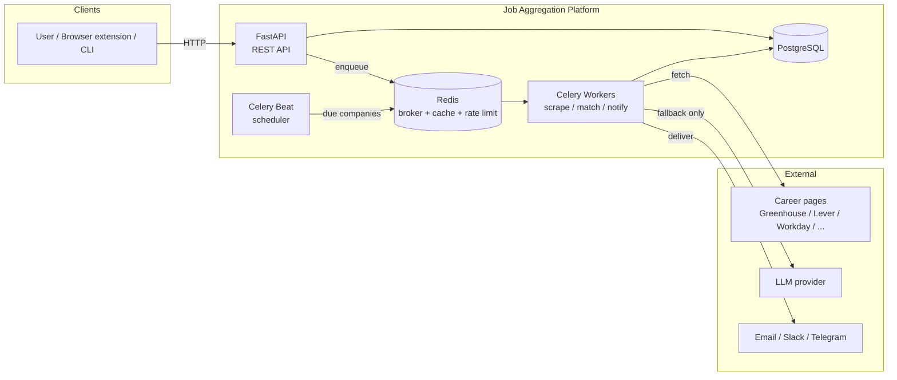
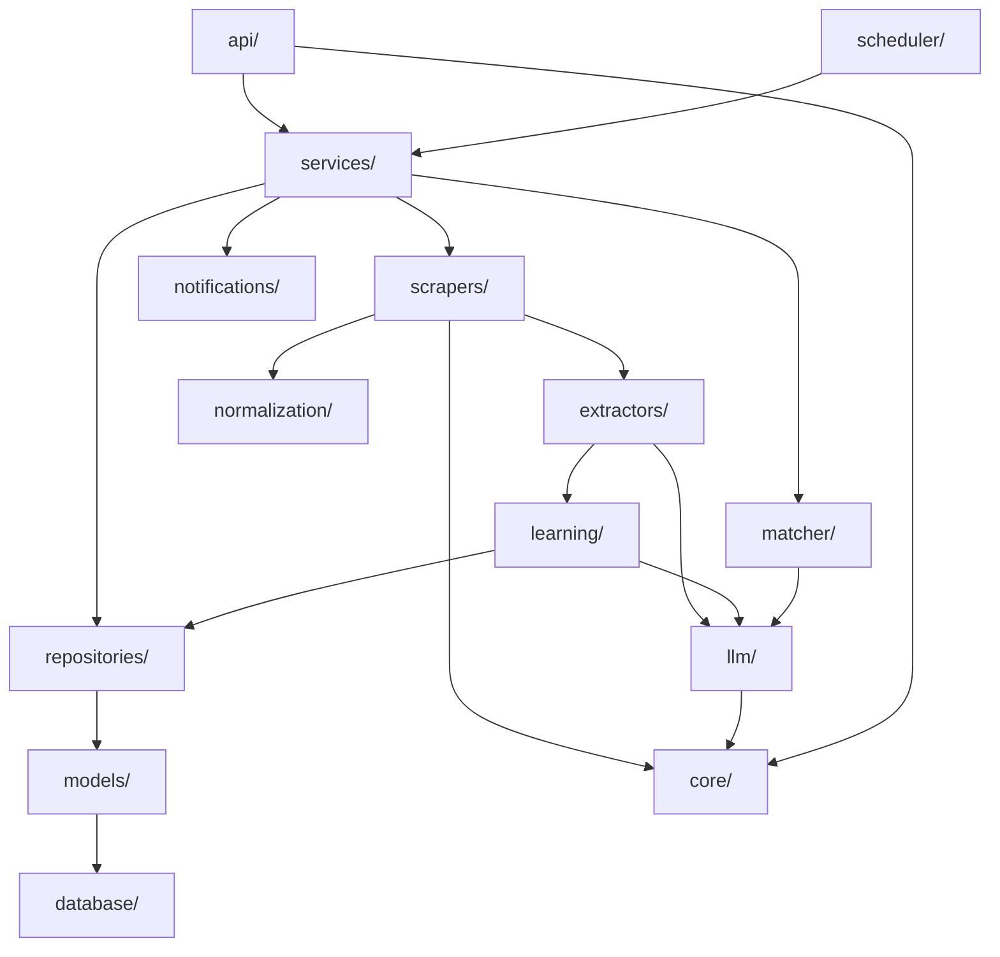
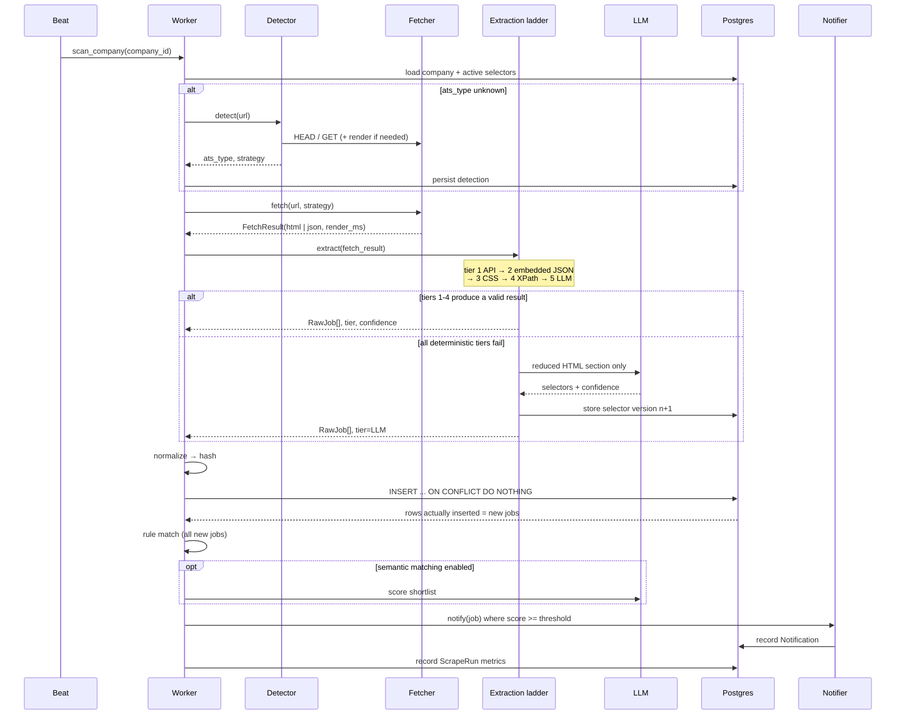
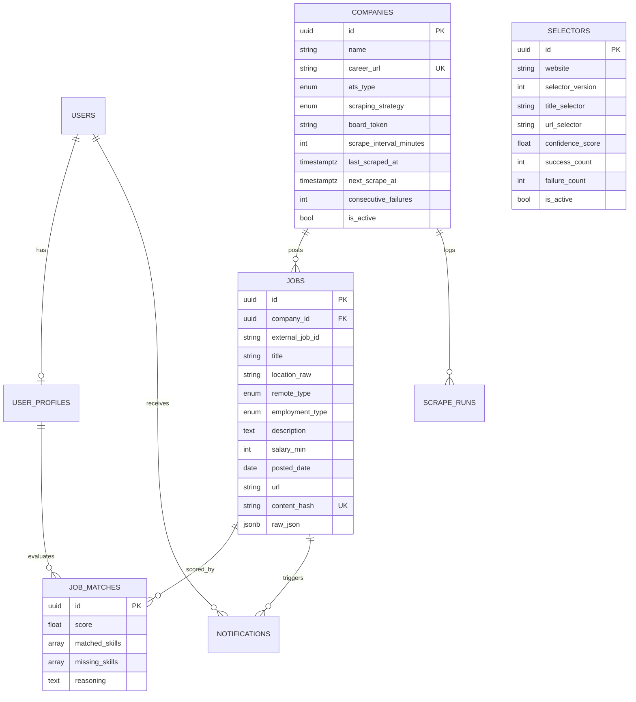

# Architecture

A self-learning job aggregation platform. Registers company career pages, scans
them on a schedule, extracts structured postings regardless of how the site is
built, matches them against a user profile, and notifies only on relevant new
jobs.

The organising principle: **LLM calls are a failure path, not a code path.** A
healthy company is scraped thousands of times without ever touching a model.

---

## 1. Architectural decisions and trade-offs

These are the decisions that shape everything else. Each one had a credible
alternative; the alternative and the reason it lost are recorded.

### AD-1 — Modular monolith, three process types

**Decision.** One codebase, one deployable image, run as three process types:
`api` (FastAPI), `worker` (Celery), `beat` (Celery Beat).

**Alternative.** True microservices — a scraper service, a matching service, a
notification service, each with its own repo and database.

**Why the monolith wins here.** The brief calls for "independent services", and
the module layout delivers that at the *code* level: `scrapers/` does not import
`notifications/`, `matcher/` does not import `scrapers/`. What microservices
would add today is network hops, distributed transactions across the
scan→dedupe→match→notify pipeline, and three deploy pipelines — all before there
is any load to justify them. The pipeline is a single logical unit of work with
a natural transaction boundary per company scan; splitting it across services
means inventing a saga to keep it consistent.

**What keeps the option open.** Dependencies point one direction only
(`api`/`scheduler` → `services` → `scrapers`/`matcher`/`notifications` →
`repositories` → `models`). Every cross-module call goes through an interface in
that module's `base.py`. Extracting `scrapers/` into its own service later is
mechanical: wrap the interface in an RPC client.

**Cost accepted.** A crash in scraping can in principle take down a worker that
is also doing matching. Mitigated by separate Celery queues (`scrape`, `match`,
`notify`) so the process types can be scaled and isolated independently.

### AD-2 — Synchronous SQLAlchemy, endpoints on the threadpool

**Decision.** One synchronous `Session` factory shared by API and workers.
FastAPI endpoints are declared `def`, not `async def`, so Starlette runs them in
its threadpool.

**Alternative.** `async def` endpoints with `AsyncSession`, and a separate sync
factory for Celery.

**Why sync wins here.** Celery's prefork worker is synchronous, and the sync
Playwright API is markedly simpler than driving async Playwright inside a task.
Going async in the API alone means **two** session factories, **two** repository
implementations, and every repository method written twice. The repositories are
the most-reused code in the system; duplicating them to gain concurrency on an
API that is not the bottleneck is a bad trade.

**Cost accepted.** API concurrency is capped by the threadpool (default 40
threads). This is a single-tenant-to-small-SaaS API whose heavy work is already
offloaded to Celery — the endpoints do short indexed reads. When it becomes the
bottleneck, the migration is per-repository, not all-or-nothing.

### AD-3 — Extraction as a priority ladder with confidence gating

**Decision.** Five tiers, tried in order, each cheaper and more reliable than
the next: **official API → embedded JSON → stored CSS selectors → stored XPath →
LLM**. A tier "wins" only if its result passes validation; otherwise the ladder
descends.

**Alternative.** Ask the LLM every time and skip the ladder entirely.

**Why the ladder wins.** Cost and latency, by roughly three orders of magnitude.
A Greenhouse board answered from its JSON API costs one HTTP request and ~50 ms.
The same board through an LLM costs a Playwright render, ~15 k input tokens, and
2–5 seconds. At 1 000 companies scanned hourly, the LLM path is ~$4 k/day; the
ladder is a rounding error. The ladder is also *more accurate* — an official API
gives exact requisition IDs and ISO dates, which no amount of HTML reading can
match.

**Cost accepted.** Five code paths to maintain instead of one, plus the
validation logic that decides when a tier has failed. This is the core
complexity of the system and it is deliberate.

### AD-4 — Learned selectors are versioned, per-domain, and never overwritten

**Decision.** `selectors` rows are keyed by `(website, selector_version)`. A
regeneration inserts version *n+1* and deactivates *n*; it never mutates a row.
Success and failure counts accumulate per version.

**Alternative.** One mutable selector row per site, updated in place.

**Why versioning wins.** Selector regeneration is an LLM call acting on a
transient page render, and it can produce something *worse* than what it
replaced — a lazy-loaded page, an A/B test, a cookie wall. With history, a
regression is detectable (success rate of v3 < v2) and revertible. Without it,
the system silently degrades and the evidence is gone. History also turns
"did this site change?" into a query instead of a guess.

**Cost accepted.** Unbounded row growth on volatile sites; capped by retaining
the last N versions per domain and pruning the rest.

### AD-5 — LLM behind a provider interface, with a hard budget ceiling

**Decision.** `LLMProvider` is a protocol with three implementations (OpenAI,
Anthropic, Gemini) plus a `NullProvider`. Provider and model come from config.
Every call passes through a budget tracker that enforces a daily USD ceiling and
a circuit breaker.

**Note on the requested model.** The brief specifies "OpenAI GPT-5.5". No model
by that identifier exists; the config default is a real, current model and the
identifier is a plain config string, so pointing it at another model is a
one-line `.env` change. This is exactly why the provider is abstracted.

**Why the budget ceiling is not optional.** The self-learning path is triggered
*by failure*. A site-wide outage, a CDN returning a 503 HTML page for every
request, or a bad deploy makes every extraction fail at once — and without a
ceiling that converts directly into every company triggering selector
regeneration in the same hour. The breaker turns a bad day into a degraded day
instead of an invoice.

### AD-6 — Deduplication by deterministic hash, enforced in the database

**Decision.** `sha256(company_id | normalized_title | normalized_location |
canonical_url)` stored on the row, with a `UNIQUE (company_id, content_hash)`
constraint. Inserts use `ON CONFLICT DO NOTHING`.

**Alternative.** Check-then-insert in application code.

**Why the constraint wins.** Two workers can scan the same company concurrently
(a manual `POST /rescan` racing the scheduled scan). Check-then-insert has a
read-write gap and will duplicate under that race. The constraint makes
"new job" a fact the database decides, not one the application hopes for — and
"was this row actually inserted?" is precisely the signal that drives
notification.

**Why these four fields.** The URL alone is unstable: boards re-tag tracking
parameters, regenerate slugs, and reissue links without the requisition
changing. Including the normalized title and location means a genuinely
unchanged posting hashes the same even when its URL churns.

### AD-7 — Matching is rules-first, LLM only for the shortlist

**Decision.** Every job passes a cheap deterministic filter (excluded keywords,
location, seniority, skill overlap). Only jobs that clear that gate — and only
when semantic matching is enabled — reach the LLM matcher for scoring and
reasoning.

**Why.** Same economics as AD-3. The rule matcher discards 90%+ of a large board
for free, and it is the layer that must never be wrong in the permissive
direction (an excluded keyword must always exclude). The LLM adds the judgment
the rules can't encode — "is this "Platform Engineer" role actually backend?" —
on the small remainder.

### AD-8 — Per-domain rate limiting in Redis, not per-process

**Decision.** A Redis token bucket keyed by domain, checked by every worker
before every fetch.

**Why.** Politeness is a property of the *target host*, not of a worker process.
With 8 workers and a per-process limiter, a company with 40 registered career
URLs on one domain gets hit 8× harder than intended. A shared bucket is the only
version of this that is actually correct.

### AD-9 — One browser per worker process, one fresh context per page

**Decision.** A process-level Playwright browser singleton, with a new
`BrowserContext` per page fetch, closed after use.

**Why not a browser per page.** Browser launch is ~1–2 s and ~100 MB; at scale
it dominates the scrape budget.
**Why not a shared context.** Contexts accumulate cookies, storage, and service
workers across sites — cross-contamination between companies, and a slow memory
leak. A context is cheap (~10 ms); a browser is not. This is the right seam.

---

## 2. System context

## 3. Internal module structure

Arrows are allowed dependency directions. There are no cycles.

`core/` (config, logging, metrics, errors) is a leaf that everything may use.
`utils/` likewise. Nothing imports `api/`.

## 4. The scan pipeline

## 5. Data model

`selectors.website` is a registrable domain, not a full URL — one learned
strategy serves every career URL on that host.

## 6. Extraction ladder in detail

| Tier | Source | Cost | Used when |
|---|---|---|---|
| 1 | Official ATS API | 1 request | `ats_type` is a known API-backed board |
| 2 | Embedded JSON (`__NEXT_DATA__`, JSON-LD `JobPosting`, inline state) | 1 request | Page ships its own data |
| 3 | Stored CSS selectors | 1 request (+render) | A validated selector version exists |
| 4 | Stored XPath | 1 request (+render) | CSS version failed; XPath variant exists |
| 5 | LLM selector generation | render + ~8–15 k tokens | Everything above failed |

A tier's output is accepted only if `validation.score()` clears
`EXTRACTION_MIN_CONFIDENCE`. Scoring weighs job count, required-field
completeness (title and URL are mandatory), and field plausibility. Tier 5
writes its result back as a new selector version, so the *next* scan of that
site re-enters at tier 3.

## 7. API surface

| Method | Path | Purpose |
|---|---|---|
| POST | `/api/v1/companies` | Register a career URL (detection runs async) |
| GET | `/api/v1/companies` | List, filter by ATS / active |
| GET | `/api/v1/companies/{id}` | Detail incl. last run stats |
| DELETE | `/api/v1/companies/{id}` | Soft delete |
| POST | `/api/v1/scan` | Scan all due companies |
| POST | `/api/v1/rescan` | Force rescan, optionally one company, `force_llm` |
| GET | `/api/v1/jobs` | Paginated, filterable by company/location/remote/score |
| GET | `/api/v1/jobs/new` | Jobs first seen within a window |
| POST | `/api/v1/profile` | Create profile |
| PUT | `/api/v1/profile` | Update profile |
| GET | `/api/v1/notifications` | Delivery log |
| GET | `/health` | Liveness + DB/Redis readiness |
| GET | `/metrics` | Prometheus exposition |

## 8. Failure handling

| Failure | Response |
|---|---|
| Transient fetch error (5xx, timeout) | Celery retry, exponential backoff + jitter, max `SCRAPE_MAX_RETRIES` |
| 403 / bot wall | Escalate strategy HTTP → Playwright once, then mark run failed |
| Extraction below threshold | Descend ladder; if tier 5 also fails, increment `failure_count`, record run |
| N consecutive company failures | Back off `next_scrape_at` exponentially; deactivate at hard limit |
| LLM budget exhausted | Circuit opens, tier 5 disabled, scans continue on tiers 1–4 |
| Notification channel down | Row marked `failed` with error, retried by a separate task |

## 9. Deliberate non-goals (and where they'd attach)

Resume-based matching, CV tailoring, automatic application, salary prediction,
vector search, multi-user SaaS. The seams that exist for them today:

- `users` table already exists and `notifications.user_id` is a real FK, so
  multi-tenancy is a scoping change, not a schema change.
- `matcher/base.py` is an interface; an embedding matcher is a fourth
  implementation alongside rule and LLM matchers.
- `jobs.raw_json` retains the full upstream payload, so any future extractor can
  be backfilled over historical rows without re-scraping.
- `llm/base.py` already carries token/cost accounting, which is what a CV
  generation feature would need to be metered by.
